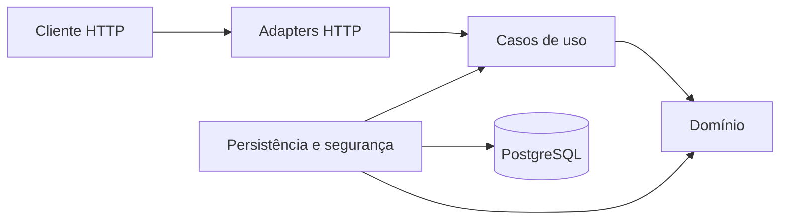
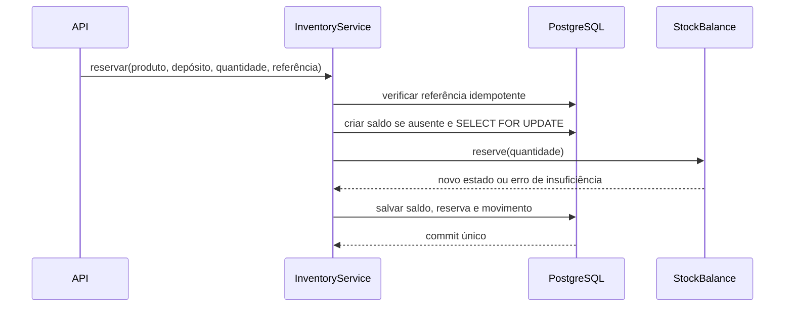

# Arquitetura e modelo do sistema

## Visão de contexto



As setas representam dependências de código. Em runtime, a aplicação chama implementações de infraestrutura por interfaces internas, aplicando inversão de dependência.

## Módulos

| Módulo | Responsabilidade | Não é responsável por |
|---|---|---|
| `product` | identidade, SKU, nome e ativação do produto | quantidades ou depósitos |
| `warehouse` | identidade e estado operacional do depósito | saldos |
| `inventory` | verdade quantitativa, reservas, movimentos e transferências | ciclo do pedido |
| `order` | itens e transições do pedido | alterar saldos diretamente |
| `identity` | autenticação, token e papéis | regras de estoque |
| `shared` | contratos técnicos mínimos e erros comuns | entidades de negócio compartilhadas |

`order` usa a porta pública de `inventory`; `inventory` consulta a existência de produto e depósito pelas portas de aplicação desses módulos. Nenhum fluxo depende de `order` a partir de `inventory`, evitando ciclo.

## Agregados e limites transacionais

### Saldo e reserva

`StockBalance` protege `onHand`, `reserved` e `available`. `Reservation` protege a transição `ACTIVE -> RELEASED` ou `ACTIVE -> CONSUMED`. Os dois são atualizados na mesma transação do caso de uso, junto com `StockMovement`.



O lock pessimista serializa alterações do mesmo produto no mesmo depósito. Em uma transferência, os dois saldos são bloqueados por ordem crescente de UUID para que transações concorrentes escolham a mesma ordem e reduzam a possibilidade de deadlock.

### Pedido

Criar um pedido reserva todos os itens na mesma transação. Qualquer falha causa rollback completo. Confirmar consome todas as reservas; cancelar libera todas. O pedido não escreve tabelas de saldo diretamente.

```text
CREATED -> RESERVED -> CONFIRMED
                    -> CANCELLED
```

`CREATED` existe como estado de domínio intermediário durante a criação. Nesta versão, somente pedidos completamente reservados são persistidos.

## Persistência

Entidades JPA são separadas dos objetos de domínio. O adapter converte os dois modelos. Relacionamentos entre módulos são persistidos como UUIDs; somente `OrderJpaEntity -> OrderItemJpaEntity` usa associação JPA, pois ambos pertencem ao mesmo agregado.

- Open Session in View está desativado.
- Coleções de itens usam `LAZY` e são carregadas explicitamente pela consulta quando necessário.
- Migrations são a fonte do schema; Hibernate usa apenas `validate`.
- Constraints repetem invariantes quantitativas e unicidade.
- Índices acompanham filtros de histórico e estado.

## Segurança

O endpoint de login autentica usuário/senha e emite JWT HMAC-SHA256. O resource server valida assinatura e expiração. Os casos de uso chamam `AccessControl`, portanto a autorização não depende apenas da rota HTTP.

O segredo e a senha inicial entram por variáveis de ambiente. Tokens, senhas e hashes não são registrados nos logs.

## Consistência e idempotência

Cada operação mutável recebe uma referência externa. Há constraints únicas no banco e validação de payload quando a referência já existe. Em concorrência extrema, uma das transações pode receber conflito de constraint, mas a transação inteira sofre rollback e nenhum efeito é duplicado.

Mensageria e Outbox foram adiados: ainda não existe comunicação externa assíncrona que justifique esses componentes.
